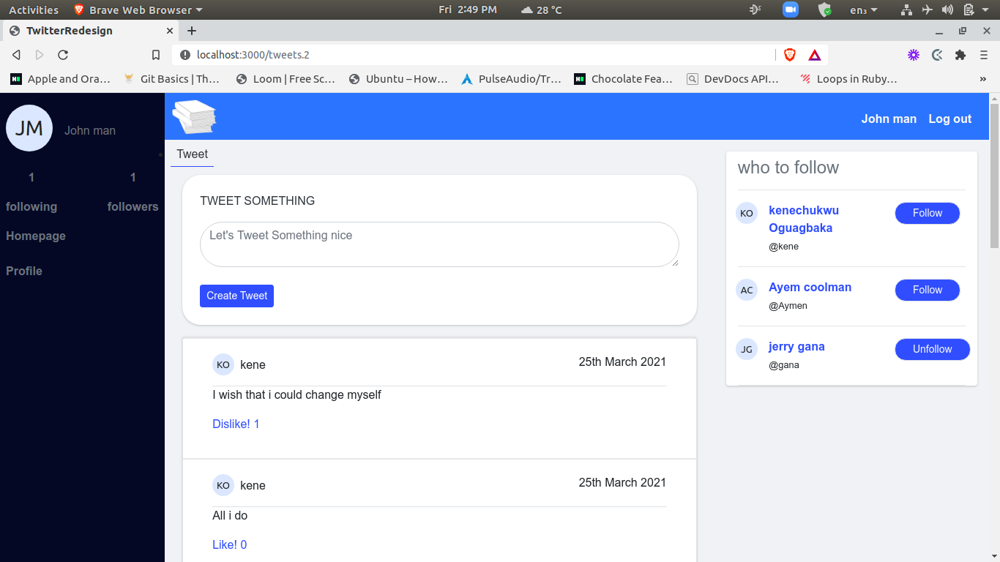

# Twitter for books

> A ruby on rails social media app where users can sign up, follow one another,
> and post tweets.

## Screenshot

### login page

### Home page

## Table of contents

- [Live demo](#live-demo)
- [Features](#features)
- [Prerequisites](#prerequisites)
- [Getting started](#getting-started)
- [Run tests](#run-tests)
- [Deployment](#deployment)
- [Authors](#authors)
- [Contributing](#contributing)
- [Show your support](#show-your-support)

## Live demo

Visit this [link](https://intense-earth-31445.herokuapp.com/)

## Features

- User can sign-in and sign-up
- User can post tweets
- User can follow one another
- User can like tweets
- User can see their stats (no. of tweets, followers, followings)

## Prerequisites

- Ruby: 2.7.2
- Rails: 6.1.1
- Postgres: >=9.5

## Getting Started

- Open your `Terminal`
- Navigate to the directory where you will like to install the repo by running `cd Folder Name`
- Run `git clone git@github.com:keneogu/twitter-redesign.git`
- `cd` into the project
- Run `git pull origin feature-branch`
- Run `bundle install`
- Run `rails db:create` to create your database
- Run `rails db:migrate` to migrate your database
- Run `rails s` and visit `localhost:3000` in your browser

## Run tests

- Run `bundle exec rspec` to run all the tests, or

## Deployment

This project is hosted on heroku.

- `heroku apps:create your_site_name`
- `heroku buildpacks:add heroku/nodejs --index 1`
- `heroku buildpacks:add heroku/ruby --index 2`
- `git push heroku main`

## Authors

### Kenechukwu Oguagbaka

- GitHub: [@keneogu](https://github.com/keneogu)
- Twitter: [@keneogu](https://twitter.com/keneogu)
- LinkedIn: [@keneogu](https://www.linkedin.com/in/kene-ogu/)

## Contributing

- Fork the project
- Create your feature branch `git checkout -b awesome-feature`
- Commit your changes `git commit -m 'Awesome feature'`
- Push it `git push -u origin awesome-feature`
- Open a pull request using this branch

## Show your support

Give a ⭐️ if you like this project!
